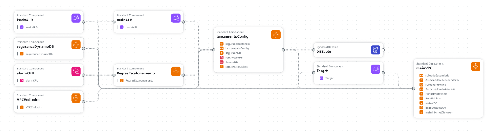
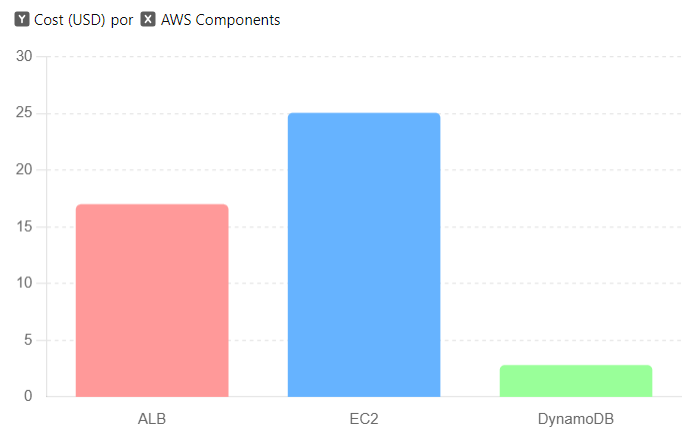

# Projeto em Nuvem - CloudFormation

(https://github.com/KevinShinohara/Projeto_de_cloud.git)

## Objetivo do Projeto
Este projeto visa provisionar uma arquitetura na AWS usando CloudFormation, incluindo um Application Load Balancer (ALB), instâncias EC2 configuradas para Auto Scaling e uma tabela no DynamoDB.

## Região de Implementação
Optamos por implantar na região *us-east-2 (Ohio)* devido aos seus custos favoráveis e desempenho confiável em comparação com outras regiões da AWS.

## Detalhes Técnicos do Projeto

### Infraestrutura como Código (IaC) com CloudFormation
- **Implementação com CloudFormation:** Todos os recursos da AWS foram provisionados usando CloudFormation.
- **Código Estruturado:** O script YAML está cuidadosamente organizado com comentários explicativos para cada recurso, facilitando a manutenção e compreensão.
- **Automatização Total:** O script CloudFormation permite criar, atualizar e destruir toda a infraestrutura com um único comando, sem necessidade de intervenção manual.

### EC2 com Auto Scaling
- **Configuração de Lançamento:** Foi configurada uma Launch Configuration com uma AMI que já possui a aplicação pré-instalada.
- **Grupo de Auto Scaling (ASG):** Um Auto Scaling Group foi criado usando a Launch Configuration especificada.
- **Políticas de Escalonamento:** As políticas de escalabilidade foram definidas com base em alarmes do CloudWatch, como utilização da CPU acima de 70%.
- **Integração com ALB:** A integração entre o ASG e o ALB foi garantida por meio do Target Group.

### Application Load Balancer (ALB)
- **Provisionamento do ALB:** Um ALB foi criado para distribuir o tráfego entre as instâncias EC2.
- **Configuração de Target Groups:** Target Groups foram configurados para gerenciar as instâncias EC2.
- **Verificações de Integridade:** Health Checks foram configurados para garantir que apenas instâncias saudáveis recebam tráfego.

### Banco de Dados DynamoDB
- **Criação da Tabela DynamoDB:** Uma tabela no DynamoDB foi provisionada para o armazenamento de dados.
- **Configuração de Segurança:** Security Groups foram configurados para garantir que apenas as instâncias EC2 possam acessar o banco de dados.

## Descrição da Infraestrutura

### Instâncias EC2
- **Tipo de Instância:** t2.micro  
  **Justificativa:** Escolhida por ser econômica e fornecer recursos suficientes (1 GB de memória e 1 vCPU) para executar a aplicação.

- **Zonas de Disponibilidade:** us-east-2a, us-east-2b (Ohio)  
  **Justificativa:** A escolha dessas zonas foi baseada no custo-benefício, sendo uma das opções mais acessíveis em termos de preço.

- **Imagem de Máquina:** ami-0f30a9c3a48f3fa79  
  **Justificativa:** Optamos por esta imagem gratuita do Amazon Linux por ser econômica e adequada para a instância t2.micro.

### Application Load Balancer (ALB)
- **Listener Configurado:** Porta 80, protocolo HTTP  
  **Justificativa:** A porta 80 e o protocolo HTTP foram escolhidos para processamento de tráfego web de forma padrão e eficiente.

- **Configuração do Target Group:**  
  **Justificativa:** O Target Group foi configurado para agrupar instâncias EC2, garantindo que apenas instâncias saudáveis recebam tráfego, com verificações de integridade regulares.

- **Security Group do ALB:** ALBSecurityGroup  
  **Justificativa:** As regras de segurança foram configuradas para permitir tráfego na porta 80 dentro da VPC, assegurando que o tráfego permaneça seguro e dentro da rede.

### Auto Scaling Group (ASG)
- **Launch Configuration Detalhada:**  
  **Justificativa:** Configuramos as instâncias com um script de inicialização que clona o repositório da aplicação e a executa, proporcionando uma implantação automática e eficiente.

- **Gerenciamento com Auto Scaling Group:**  
  **Justificativa:** O ASG gerencia as instâncias em um grupo lógico para escalabilidade automática, garantindo que o número de instâncias varie conforme a demanda, com um mínimo de 2 e máximo de 7 instâncias.

- **Políticas de Escalonamento:**  
  **Justificativa:** As políticas de escalabilidade foram baseadas na utilização da CPU. Ao atingir 70% de utilização, novas instâncias são adicionadas, monitoradas por um CloudWatch Alarm configurado para verificar a CPU a cada minuto em intervalos de 5 períodos.

### Banco de Dados DynamoDB
- **Tabela DynamoDB:**  
  **Justificativa:** A tabela foi configurada com uma chave primária id e capacidades de leitura/escrita de 5 unidades por segundo, proporcionando um balanceamento eficiente entre desempenho e custo.

- **IAM Role Configurada:**  
  **Justificativa:** As instâncias EC2 recebem permissões através de IAM Roles, permitindo operações seguras no DynamoDB como GET, PUT, DELETE, UPDATE e SCAN.

- **Perfil de Instância:**  
  **Justificativa:** Anexa a IAM Role às instâncias EC2, assegurando que as permissões necessárias estejam disponíveis.

- **VPC EndPoint:**  
  **Justificativa:** Conecta a VPC ao serviço DynamoDB, com rotas públicas direcionando o tráfego ao VPC Endpoint e ao Internet Gateway, garantindo uma conexão eficiente e segura.

## Análise de Custos

Aqui está o gráfico de barras mostrando a distribuição dos custos mensais da infraestrutura AWS. As barras representam os seguintes custos:

ALB: $17.00
EC2: $25.056
DynamoDB: $2.808


## Considerações Finais
Este documento detalha a implementação de uma arquitetura na AWS utilizando CloudFormation. A infraestrutura provisionada é robusta e escalável, com componentes essenciais como ALB, EC2 com Auto Scaling, e DynamoDB. As decisões técnicas foram baseadas em custo e desempenho, visando otimizar os recursos utilizados e manter os custos baixos.

## Execução
Para rodar o código, primeiro é necessário ter o AWS CLI instalado na sua máquina.

### Geração de KeyPairs
```bash
aws ec2 create-key-pair --key-name <NomeDaSuaChave> --query 'KeyMaterial' --output text > <NomeDaSuaChave>.pem

aws cloudformation create-stack --stack-name my-stack --template-body file://configure.yaml --parameters ParameterKey=KeyName,ParameterValue=<Nome da chave Criada> --capabilities CAPABILITY_IAM

